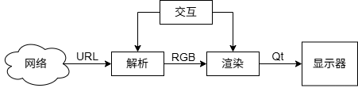
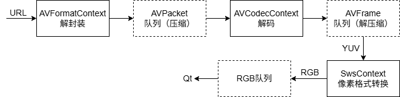

# 项目概述
嵌入式视频学习: 直播播放器. 具备以下技术特点,
- [x] 能够正常拉流并显示
- [ ] 硬件解码
- [ ] 硬件绘制图像
- [ ] 低延时
- [ ] 断流重连

---

# 第三方库
* FFmpeg
* nlohmann::json

---

# 软件架构
直播播放器可以分为以下模块,

* **控制与交互模块**: 基于 Qt 控件设计图形界面; 实现解析URL, 开始播放, 暂停播放, 停止播放等控制功能
* **解析模块** (软件解码): 基于 FFmpeg 搭建解析流水线 —— 从 URL 开始, 经过解封装, 解码, 像素格式转换; 得到可渲染的 RGB 图像
* **渲染模块** (软件渲染): 基于 QWidget 的 QPaintEvent 事件实现图像绘制
## 解析流水线

## QPaintEvent 事件
* 每得到一张 RGB 图像, 调用 `QWidget::update()` 通知 QWidget 实例重新绘制

---

# 基础技术
## FFmpeg 封装
* 基于 RAII 思想, 对 FFmpeg 的以下结构体进行封装: `AVFormatContext`, `AVPacket`, `AVCodecContext`, `AVFrame`, `SwsContext`
## 环形缓冲区 (单生产者-单消费者)
* 自动占用旧数据
## 零拷贝
* 移动构造/移动赋值: `AVPacket` 和 `AVFrame` 的封装
* 环形缓冲区存储 `AVPacket` 和 `AVFrame` 的智能指针
* `QImage` 从 `AVFrame::data` 构造
## 播放时钟
* 取单调增长的 `std::chrono::steady_clock::now()` 作为播放时钟
* 取阈值 `t1` (>0), `t2` (<0)
* 计算渲染的帧 `diff = pts - clock`, 策略
    * `diff > t1`: 阻塞 `diff - t1` 后渲染
    * `diff < t2`: 丢帧
    * 否则, 直接渲染

---

